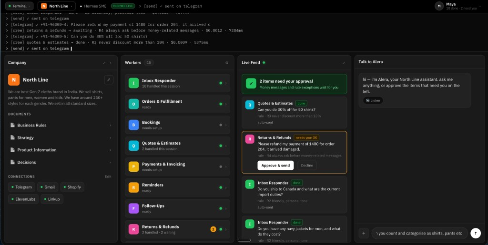

# Hermes SME

**A control panel that turns a [Hermes](https://github.com/NousResearch) agent into a self-directed assistant for a small business — no terminal, no config, no "agent" jargon.**

The owner opens one screen and sees their **rules**, a **live feed** of what the assistant did (or wants approval for, or declined — always with the reason), an **ask box**, and their **documents**. Under the hood it's a real, locally-running Hermes agent. The assistant is named **Alera**.



---

## Why

Hermes is a powerful CLI agent, but a shop owner will never touch a terminal. Hermes SME is the missing surface: a two-way GUI where a non-technical owner can **watch** what the agent is doing and **drive** it — chat, approvals, business documents, and workers — from a single dashboard, while the agent runs the business day to day.

The guardrail that makes it trustworthy: **it always asks before anything money-related.** Money messages and rule exceptions wait for a human tap.

## How it works

```
  Browser (5173)             Hermes SME UI             Hermes agent (CLI)
  ┌───────────┐   http/poll   ┌──────────┐   exec/files  ┌────────────────┐
  │  cockpit  │ ◀───────────▶ │  adapter │ ◀───────────▶ │ brain/ · memory │
  └───────────┘   :5173       │  :8787   │               └────────────────┘
                              └──────────┘
```

- **UI** — a single-page cockpit (React + TypeScript + Vite).
- **Adapter** (`server/hermes-adapter.mjs`) — a thin, zero-dependency Node bridge. The browser can't spawn a process, so the adapter shells out to the real `hermes` CLI and serves the shared `brain/` folder.
- **`brain/`** — plain Markdown the agent reads and writes (rules, strategy, product, decisions, signals…). Editing a document here is how you "program" the assistant.

Every action is two-way and synchronous — no cron, no polling for a job to finish. You ask, Hermes runs, you get the answer.

## The dashboard

| Panel | What it shows |
|---|---|
| **Company** | Business profile (editable), and the core documents — Business Rules, Strategy, Product Information, Decisions. The list grows as the agent creates new docs. |
| **Workers** | The jobs the assistant runs — inbox responder, orders & fulfillment, reminders, follow-ups, reviews, product insights, and more. Click one to see what it does, what it needs, and turn it on/off. |
| **Live Feed** | Everything the assistant did, is drafting, or is waiting on — with the rule it followed. Money items surface an **Approve & send** gate. |
| **Talk to Alera** | Chat with the real agent, grounded in your business. |

## Quick start

Two terminals, from this folder:

```bash
npm install
npm run hermes    # bridge to your local Hermes agent → http://localhost:8787
npm run dev       # UI → http://localhost:5173
```

Point the UI at the adapter with `.env.local`:

```
VITE_HERMES_URL=http://localhost:8787
```

Without it, the UI runs in a self-contained **demo** mode (no agent required) — handy for trying the interface.

> Full walkthrough: **[SETUP.md](./SETUP.md)** · Adapter API contract: **[docs/hermes-bridge-api.md](./docs/hermes-bridge-api.md)**

## Onboarding

On first run the chat starts in **setup** mode. Click **✎ Edit business**, enter your business name and what you do, and **Save & remember**. Hermes then:

1. stores the profile in its long-term memory (so it remembers every session),
2. adopts the persona of *your* business's assistant, and
3. sets up the workers.

From then on, Alera answers as your business's assistant.

## Prerequisites

- **Node.js 20+**
- A locally installed, authenticated [Hermes agent](https://github.com/NousResearch) — run `hermes model` to pick a provider. (Demo mode needs neither.)

## Project layout

```
alera/
├── src/                 # React UI (cockpit)
│   ├── App.tsx          # shell: top bar, terminal, side panels
│   ├── pages/Home.tsx   # the 4-column dashboard
│   ├── components/       # side panel (docs, workers, settings)
│   └── lib/             # hermesClient (the one bridge the UI calls)
├── server/
│   └── hermes-adapter.mjs   # thin bridge to the real hermes CLI
├── brain/               # Markdown the agent reads/writes (seed sample data)
└── docs/                # setup, bridge API, screenshots
```

## Tech

React 19 · TypeScript · Vite · Node (adapter) · [Nous Research Hermes](https://github.com/NousResearch) (runtime).

## Privacy

Runtime agent output (customer messages, phone numbers, conversation traces) lives in `brain/customers/` and `brain/traces/` and is **git-ignored** — it never leaves your machine.
